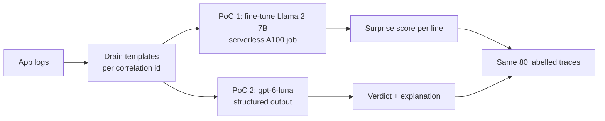
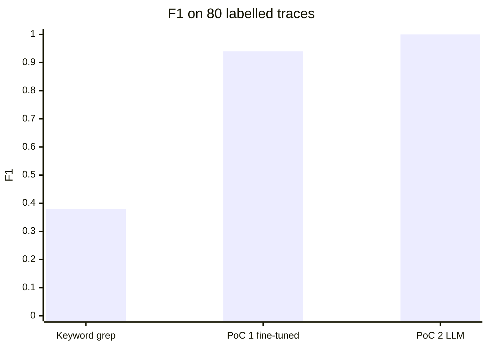
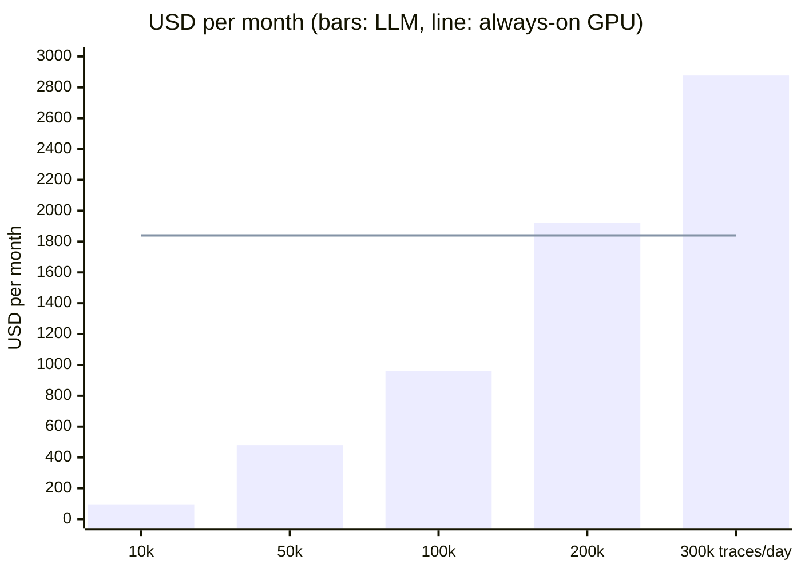

# Log anomaly detection: fine-tuned GPU model vs LLM

The customer wants to settle two questions:

1. Can we fine-tune models on serverless GPU instead of a GPU compute instance?
2. To detect and explain anomalies in production logs in real time, should we fine-tune a model (LogLLaMA approach) or call an LLM with structured output?

This repo rehearses both on synthetic data: 10 days of logs, 4 business flows, 2 incidents, 80 labelled traces.

## What the rehearsal shows

| Question | Shown here | Open: needs the customer's data and tenant |
|---|---|---|
| 1. Serverless GPU fine-tuning | Yes: Llama 2 7B LoRA on a serverless A100 in 8 min, no compute instance, every run versioned | Runs of hours to days with checkpoints; Azure ML serverless; private network without keys |
| 2. Fine-tune or LLM | LLM: F1 1.00 vs 0.94, explains every verdict, no training, cheaper for real-time use | Accuracy on real logs, early warning before incidents, real log volume |

## How it works



- PoC 1 learns normal traces and flags lines that surprise it
- PoC 2 checks each trace against the expected flows, with reasoning `none`; enums keep every answer valid (`build_schema` in `src/logpoc/poc2_llm/classify.py`)
- Every run records git commit, image, data hash and base model commit

## Results



| | Keyword grep | PoC 1: Llama 2 7B | PoC 2: gpt-6-luna |
|---|---|---|---|
| Anomalies caught (of 30) | 7 | 30 | 30 |
| False alarms (of 50 normal) | 0 | 4 | 0 |
| Explains the verdict | no | no | yes |
| Training | none | 8 min here, hours on real data | none |

## Cost of real-time detection



- GPU: an A100 that stays on for scoring ($2.48 per hour on Container Apps) plus one retraining run a month
- LLM: $0.32 per 1,000 traces, about 2,200 tokens each; prompt caching cuts this by about 70%
- The LLM is cheaper below about 190,000 traces a day
- One 24-hour fine-tuning run: $59 on Container Apps, $115 on Azure ML, about $23 on Azure ML spot (Azure list prices)

## Platforms

**Azure ML serverless jobs**: suited to long training
- \+ Long and multi-node jobs, spot A100 at about $0.94 per hour, MLflow tracking, model registry, managed network
- − Needs A100 VM quota (0 in this test subscription, so not tested here)

**Container Apps serverless GPU**: tested
- \+ A100 billed per second, nothing to pay when idle, own GPU quota, one image runs the whole pipeline
- − One GPU per replica; long runs need a file share for checkpoints, which needs storage keys (blocked by policy here)

**Foundry LLM**: tested
- \+ No training, no GPU, every verdict explained, change behaviour by editing the flow description
- − Pay per token; only as good as the flow description

**GPU compute instance**: today
- − A VM that bills while on and needs looking after (disk, kernels)

## Bring to the customer PoC

- The 2 incidents: start and end times
- 50–100 labelled traces and the expected steps of 3–5 critical flows
- Log volume in traces per day: it decides LLM or GPU
- An agreed bar: F1 and cost per detected incident
- Access: A100 quota, a Foundry deployment, roles for the people who submit jobs

## Redo in the customer's tenant

- Customer data goes in `data/customer` (git-ignored), shaped like `data/synthetic/prod_like`: `logs/*.log` with `<ts> <LEVEL> <service> host=<host> corrId=<id> <message>`, plus `traces_labelled.jsonl`, `incidents.csv`, `flows.yaml`
- Add the customer's value fields to `MASKED_KEYS` in `src/logpoc/data/prepare.py`
- Official Llama 2 weights: accept Meta's licence on Hugging Face, set `meta-llama/Llama-2-7b-hf` in `configs/llama2_7b.yaml`, add an `HF_TOKEN` secret to the job
- Watch out: check region capacity for Container Apps, tenant policy on storage keys, and the LLM's tokens-per-minute quota (one batch of 80 traces per minute at 333K)

```bash
uv venv --python 3.12 .venv && uv pip install -e ".[llm]"
export ML_ROOT=.ml
python -c "from pathlib import Path; from logpoc.data.generate_prod_like import write_splits; print(write_splits(Path('data/customer')))"

RG=rg-logpoc; az group create -n $RG -l italynorth
az deployment group create -g $RG -f infra/main.bicep -p userObjectId=$(az ad signed-in-user show --query id -o tsv)
ACR=$(az acr list -g $RG --query "[0].name" -o tsv); TAG=$(git rev-parse --short HEAD)
az acr build -r $ACR -t logpoc:$TAG --build-arg GIT_SHA=$TAG --build-arg IMAGE_TAG=$TAG .
az deployment group create -g $RG -f infra/jobs.bicep -p imageTag=$TAG data=data/customer

# PoC 1: one A100 run; when it has finished, copy its RESULT log line into a local run folder
az containerapp job update -n job-run -g $RG --set-env-vars RUN_ID=llama2-$TAG
az containerapp job start -n job-run -g $RG
WS=$(az monitor log-analytics workspace show -g $RG -n log-logpoc --query customerId -o tsv)
az monitor log-analytics query -w $WS --analytics-query "ContainerAppConsoleLogs_CL | where Log_s startswith 'RESULT ' | top 1 by TimeGenerated | project Log_s" --query "[0].Log_s" -o tsv | python -m logpoc save-result

# PoC 2 and the comparison table (.ml/runs/RUNS.md)
export AZURE_OPENAI_ENDPOINT=$(az deployment group show -g $RG -n main --query properties.outputs.foundryEndpoint.value -o tsv)
python -m logpoc poc2-llm --data data/customer --split test --context expected-flow --concurrency 20 --run-id llm-$TAG
python -m logpoc baseline-grep --data data/customer --split test --run-id grep-$TAG
python -m logpoc compare --pricing configs/pricing_azure_list.yaml
```

- More detail: [DECISIONS.md](DECISIONS.md), [data/synthetic/prod_like/README.md](data/synthetic/prod_like/README.md)
