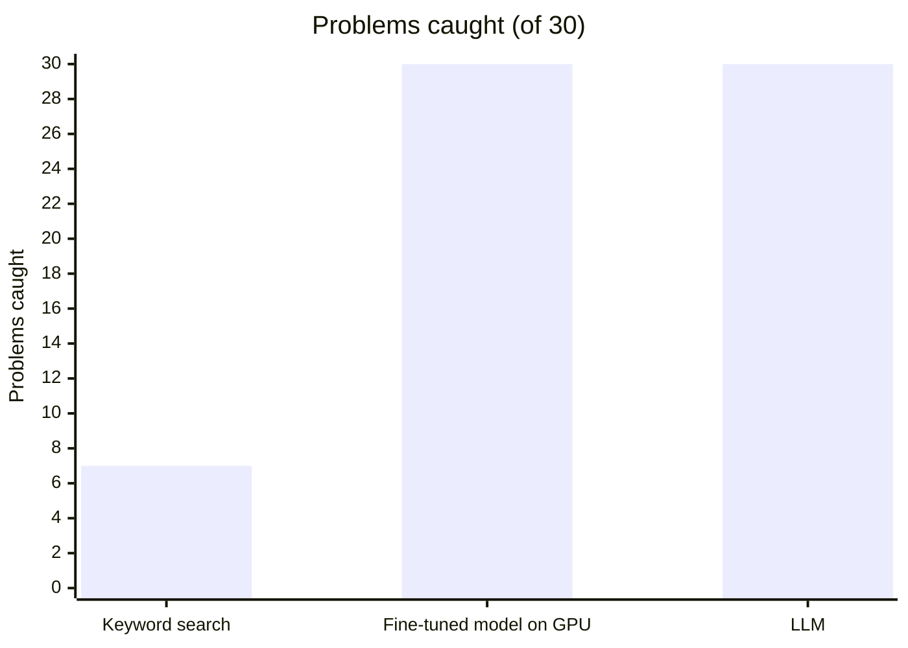
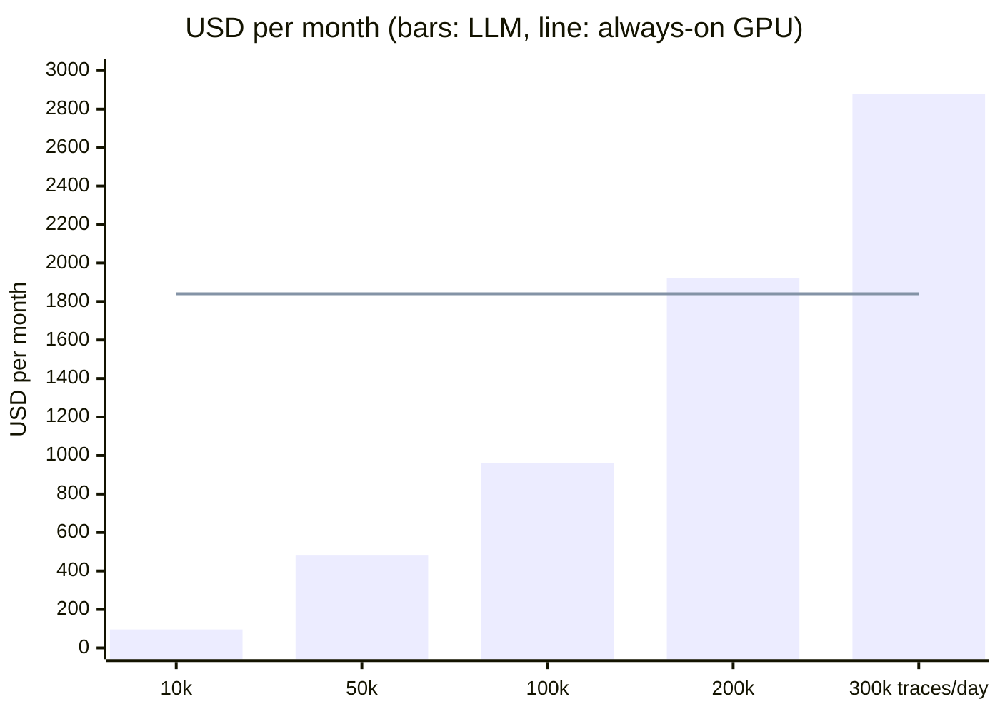
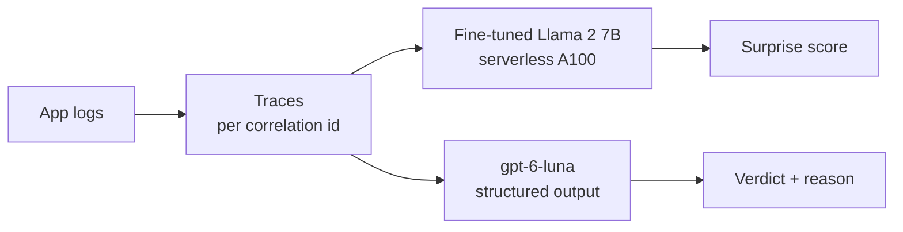

# Find broken business flows in your logs. No GPU. No training.

## 🎯 30 of 30 problems caught · 0 false alarms · every finding explained

One LLM call per trace beat a fine-tuned 7B model on our rehearsal data.

---

## 😟 The problem

### Keyword search misses 77% of problems

- 23 of 30 broken flows never log an ERROR: a step is skipped, steps run out of order, the flow stops early, or a step repeats

## ✅ The result



| | Keyword search | Fine-tuned model on GPU | LLM |
|---|---|---|---|
| Problems caught (of 30) | 7 | 30 | **30** |
| False alarms (of 50 normal) | 0 | 4 | **0** |
| Explains why | no | no | **yes** |
| Training needed | none | GPU hours | **none** |

### 💬 Every finding comes with a reason

> "The mortgage application flow first fails at a6, credit assessment, which is missing before a7 on line 6."

## 💰 Cheap

### $0.32 per 1,000 traces, about $0.09 with prompt caching

- **Prompt caching:** 94% of every call is the same instructions and flow descriptions. Azure keeps that identical start of the prompt and bills it at a tenth of the price ([how it works](https://learn.microsoft.com/azure/foundry/openai/how-to/prompt-caching))
- **Always-on GPU:** about $1,800 a month. **LLM at 10,000 traces a day:** about $100 a month ([Azure OpenAI prices](https://azure.microsoft.com/pricing/details/azure-openai/))



## ⚡ Fast

### 80 traces checked in 8 seconds

- 20 calls in parallel, nothing to start up

## How it works



- Structured outputs with fixed answer choices keep every answer valid ([docs](https://learn.microsoft.com/azure/foundry/openai/how-to/structured-outputs))

## 🥇 Option 1: LLM on Foundry (recommended)

### ✅ Pros
- No training, no GPU, no model to own
- Explains every finding
- Change it by editing the flow description
- Cheapest below about 190,000 traces a day

### ❌ Cons
- Cost grows with traffic
- Only as good as the flow description
- Pin the model version and re-test on every change

## 🥈 Option 2: Fine-tune on Azure ML serverless GPU

### ✅ Pros
- Long and multi-node training, spot A100 about $0.94 per hour
- Experiment tracking and model registry built in
- Managed network and managed identity ([docs](https://learn.microsoft.com/azure/machine-learning/how-to-use-serverless-compute))

### ❌ Cons
- Needs A100 quota (0 in our test subscription, so not tested)
- Retrain and re-threshold whenever the logs change
- Flags problems without saying why

## 🥉 Option 3: Fine-tune on Container Apps serverless GPU (tested)

### ✅ Pros
- A100 billed per second, $0 when idle ([docs](https://learn.microsoft.com/azure/container-apps/gpu-serverless-overview))
- Own GPU quota: worked where A100 VM quota was 0
- One container runs download, training and scoring

### ❌ Cons
- One GPU per job, no multi-node training
- Long runs need storage keys for checkpoints (blocked by policy here)
- No experiment tracking or model registry

## 📚 Backed by research

- ✅ **Prompting beat trained detectors by up to 56%**, with no training ([LogPrompt, 2023](https://arxiv.org/abs/2308.07610))
- ✅ **Microsoft, 100,000+ real incidents:** GPT-4 with examples beat a fine-tuned model by 25% at finding root causes ([2024](https://arxiv.org/abs/2401.13810))
- ⚖️ **Fine-tuned models still lead public benchmarks** ([LogLLM, 2024](https://arxiv.org/abs/2411.08561); [LogLLaMA, 2025](https://arxiv.org/abs/2503.14849))
- ➕ **Industry pairs both:** rules find the incident, the LLM explains it ([Microsoft RCACopilot, 2023](https://arxiv.org/abs/2305.15778))
- 💲 **Tokens got cheap:** GPT-4 cost $30 input and $60 output per 1M tokens in 2023; gpt-6-luna costs $0.12 and $0.60

## 🧭 When to choose the GPU instead

- Logs have no correlation ids, only time windows
- Problems cannot be described as a broken flow
- Millions of traces a day must be checked in real time

## 🔬 How we tested

- Synthetic logs: 10 days, 4 business flows, 2 incidents, 80 labelled traces
- Next: the same test on real logs

<details>
<summary>Run it in your tenant</summary>

- Put your data in `data/customer` (git-ignored), shaped like `data/synthetic/prod_like`: `logs/*.log` with `<ts> <LEVEL> <service> host=<host> corrId=<id> <message>`, plus `traces_labelled.jsonl`, `incidents.csv`, `flows.yaml`
- Add your value fields to `MASKED_KEYS` in `src/logpoc/data/prepare.py`
- Official Llama 2 weights: accept Meta's licence on Hugging Face, set `meta-llama/Llama-2-7b-hf` in `configs/llama2_7b.yaml`, add an `HF_TOKEN` secret to the job

```bash
uv venv --python 3.12 .venv && uv pip install -e ".[llm]"
export ML_ROOT=.ml
python -c "from pathlib import Path; from logpoc.data.generate_prod_like import write_splits; print(write_splits(Path('data/customer')))"

RG=rg-logpoc; az group create -n $RG -l italynorth
az deployment group create -g $RG -f infra/main.bicep -p userObjectId=$(az ad signed-in-user show --query id -o tsv)
ACR=$(az acr list -g $RG --query "[0].name" -o tsv); TAG=$(git rev-parse --short HEAD)
az acr build -r $ACR -t logpoc:$TAG --build-arg GIT_SHA=$TAG --build-arg IMAGE_TAG=$TAG .
az deployment group create -g $RG -f infra/jobs.bicep -p imageTag=$TAG data=data/customer

# Fine-tuned GPU: one A100 run; when it has finished, copy its RESULT log line into a local run folder
az containerapp job update -n job-run -g $RG --set-env-vars RUN_ID=llama2-$TAG
az containerapp job start -n job-run -g $RG
WS=$(az monitor log-analytics workspace show -g $RG -n log-logpoc --query customerId -o tsv)
az monitor log-analytics query -w $WS --analytics-query "ContainerAppConsoleLogs_CL | where Log_s startswith 'RESULT ' | top 1 by TimeGenerated | project Log_s" --query "[0].Log_s" -o tsv | python -m logpoc save-result

# LLM, keyword baseline and the comparison table (.ml/runs/RUNS.md)
export AZURE_OPENAI_ENDPOINT=$(az deployment group show -g $RG -n main --query properties.outputs.foundryEndpoint.value -o tsv)
python -m logpoc poc2-llm --data data/customer --split test --context expected-flow --concurrency 20 --run-id llm-$TAG
python -m logpoc baseline-grep --data data/customer --split test --run-id grep-$TAG
python -m logpoc compare --pricing configs/pricing_azure_list.yaml
```

More detail: [DECISIONS.md](DECISIONS.md), [data/synthetic/prod_like/README.md](data/synthetic/prod_like/README.md)

</details>
