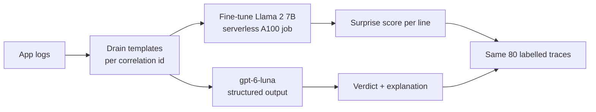
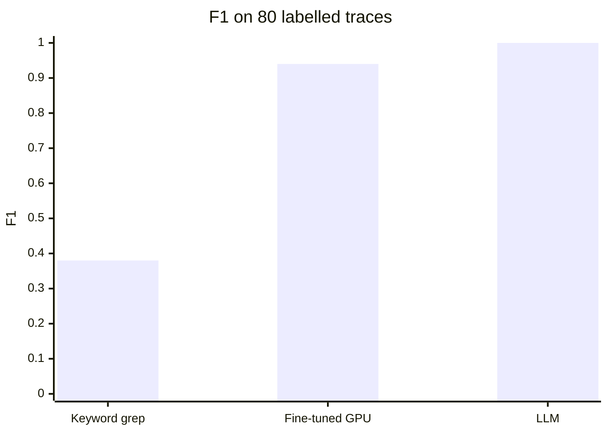
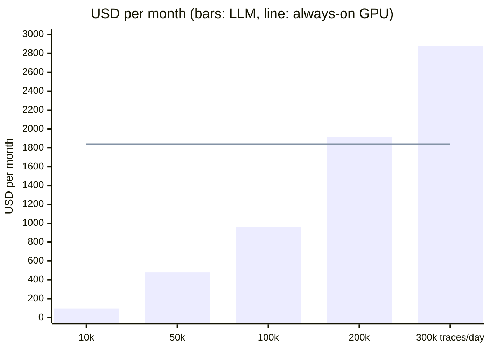

# Log anomaly detection: fine-tuned GPU model vs LLM

Can one LLM call per trace replace GPU fine-tuning to detect and explain anomalies in production logs?
Rehearsed on synthetic data: 10 days of logs, 4 business flows, 2 incidents, 80 labelled traces.

## Answer

- **Detection: the LLM wins.** F1 1.00 vs 0.94, explains every verdict, no training, cheaper below about 190,000 traces a day
- **Training: serverless GPU works.** Llama 2 7B fine-tuned on a serverless A100 in 8 minutes, every run versioned
- **Still to prove on real logs:** accuracy, early warning before incidents, real volume

## How it works



## Results



| | Keyword grep | Fine-tuned Llama 2 7B | gpt-6-luna |
|---|---|---|---|
| Anomalies caught (of 30) | 7 | 30 | 30 |
| False alarms (of 50 normal) | 0 | 4 | 0 |
| Explains the verdict | no | no | yes |
| Training | none | 8 min here, hours on real data | none |

## Cost of real-time detection



- LLM: $0.32 per 1,000 traces (about 2,200 tokens each); prompt caching cuts this by about 70%
- GPU: an A100 that stays on for scoring ($2.48 per hour) plus one retraining run a month
- One 24-hour fine-tuning run: $59 on Container Apps, $115 on Azure ML, about $23 on Azure ML spot (Azure list prices)

## Option 1: Foundry LLM (recommended for detection)

### ✅ Pros
- No training, no GPU, no model to own
- Explains every verdict: flow, broken step, line
- Change behaviour by editing the flow description
- Cheapest below about 190,000 traces a day

### ❌ Cons
- Pay per token: cost grows with traffic
- Only as good as the flow description
- Hosted model: pin the version and rerun a labelled regression set on every change

## Option 2: Azure ML serverless GPU (if fine-tuning is needed)

### ✅ Pros
- Long and multi-node training, spot A100 at about $0.94 per hour
- MLflow tracking and model registry built in
- Managed network and managed identity

### ❌ Cons
- Needs A100 VM quota (0 in this test subscription, so not tested here)
- A model to retrain and re-threshold whenever the logs change
- No explanation of why a trace is flagged

## Option 3: Container Apps serverless GPU (tested)

### ✅ Pros
- A100 billed per second, nothing to pay when idle
- Own GPU quota: ran where A100 VM quota is 0
- One image runs download, training and scoring

### ❌ Cons
- One GPU per replica, no multi-node training
- Long runs need a file share for checkpoints, which needs storage keys (blocked by policy here)
- No experiment tracking or model registry

## What the research says

- ✅ **Prompting can beat training:** LogPrompt, no in-domain training, beat detectors trained on thousands of logs by up to 55.9% ([arXiv 2308.07610](https://arxiv.org/abs/2308.07610), 2023)
- ✅ **Microsoft, 100,000+ production incidents:** GPT-4 with in-context examples beat a fine-tuned model by 24.8% at root cause analysis, avoiding fine-tuning cost ([arXiv 2401.13810](https://arxiv.org/abs/2401.13810), 2024)
- ❌ **Fine-tuning still leads public benchmarks:** LogLLM +6.6% F1 over the previous best ([arXiv 2411.08561](https://arxiv.org/abs/2411.08561), 2024); LogLLaMA ([arXiv 2503.14849](https://arxiv.org/abs/2503.14849), 2025)
- ➕ **Industry combines both:** Microsoft RCACopilot matches incidents with rules, then an LLM explains the root cause ([arXiv 2305.15778](https://arxiv.org/abs/2305.15778), 2023)
- 💲 **Tokens got cheap:** GPT-4 cost $30 input and $60 output per 1M tokens in 2023; gpt-6-luna costs $0.12 and $0.60

## When fine-tuning would still win

- The logs have no correlation ids, only time windows
- The anomalies cannot be described as a broken flow, only as unusual patterns
- Millions of traces a day must be scored in real time

## Redo in the customer's tenant

- Customer data goes in `data/customer` (git-ignored), shaped like `data/synthetic/prod_like`: `logs/*.log` with `<ts> <LEVEL> <service> host=<host> corrId=<id> <message>`, plus `traces_labelled.jsonl`, `incidents.csv`, `flows.yaml`
- Add the customer's value fields to `MASKED_KEYS` in `src/logpoc/data/prepare.py`
- Official Llama 2 weights: accept Meta's licence on Hugging Face, set `meta-llama/Llama-2-7b-hf` in `configs/llama2_7b.yaml`, add an `HF_TOKEN` secret to the job

```bash
uv venv --python 3.12 .venv && uv pip install -e ".[llm]"
export ML_ROOT=.ml
python -c "from pathlib import Path; from logpoc.data.generate_prod_like import write_splits; print(write_splits(Path('data/customer')))"

RG=rg-logpoc; az group create -n $RG -l italynorth
az deployment group create -g $RG -f infra/main.bicep -p userObjectId=$(az ad signed-in-user show --query id -o tsv)
ACR=$(az acr list -g $RG --query "[0].name" -o tsv); TAG=$(git rev-parse --short HEAD)
az acr build -r $ACR -t logpoc:$TAG --build-arg GIT_SHA=$TAG --build-arg IMAGE_TAG=$TAG .
az deployment group create -g $RG -f infra/jobs.bicep -p imageTag=$TAG data=data/customer

# Fine-tuned GPU: one A100 run; when it has finished, copy its RESULT log line into a local run folder
az containerapp job update -n job-run -g $RG --set-env-vars RUN_ID=llama2-$TAG
az containerapp job start -n job-run -g $RG
WS=$(az monitor log-analytics workspace show -g $RG -n log-logpoc --query customerId -o tsv)
az monitor log-analytics query -w $WS --analytics-query "ContainerAppConsoleLogs_CL | where Log_s startswith 'RESULT ' | top 1 by TimeGenerated | project Log_s" --query "[0].Log_s" -o tsv | python -m logpoc save-result

# LLM, keyword baseline and the comparison table (.ml/runs/RUNS.md)
export AZURE_OPENAI_ENDPOINT=$(az deployment group show -g $RG -n main --query properties.outputs.foundryEndpoint.value -o tsv)
python -m logpoc poc2-llm --data data/customer --split test --context expected-flow --concurrency 20 --run-id llm-$TAG
python -m logpoc baseline-grep --data data/customer --split test --run-id grep-$TAG
python -m logpoc compare --pricing configs/pricing_azure_list.yaml
```

- More detail: [DECISIONS.md](DECISIONS.md), [data/synthetic/prod_like/README.md](data/synthetic/prod_like/README.md)
