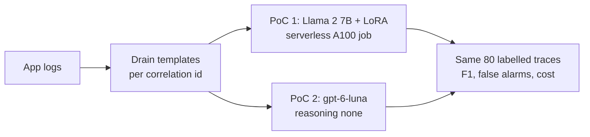
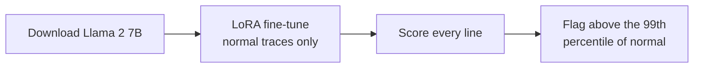
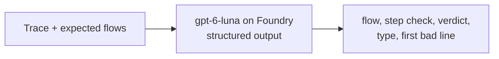
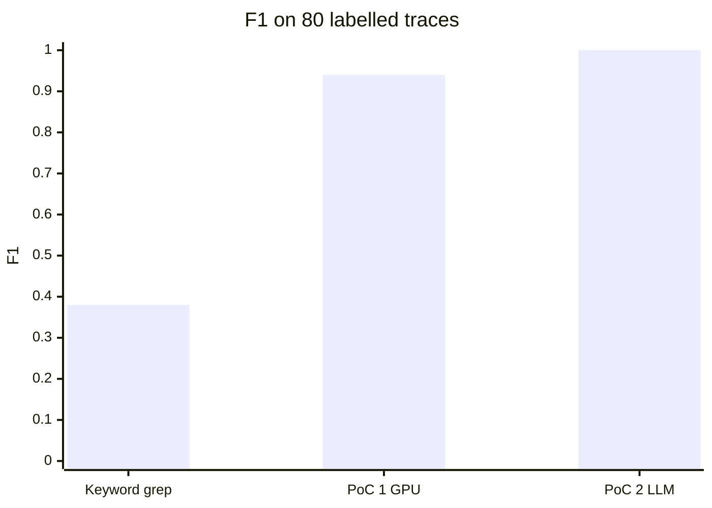
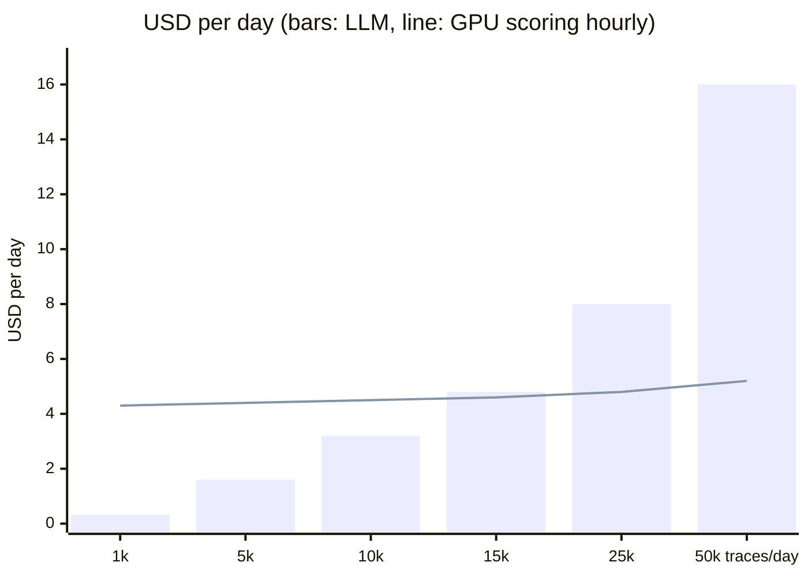

# Log anomaly detection: fine-tuned GPU model vs LLM

- Goal: catch broken business flows in production logs before customers notice
- Question: fine-tune a 7B model on a GPU, or make one LLM call per trace?
- Data: synthetic 10-day production-like extract (4 flows, 2 incidents, 80 labelled traces); no customer data here

## How it works



**PoC 1: learn normal, flag surprises**



**PoC 2: check each trace against the expected flows**



- Enums keep every answer inside valid values (`build_schema` in `src/logpoc/poc2_llm/classify.py`)
- `step_check` makes the model match every expected step before it decides, so it needs no reasoning tokens

## Results



| | Keyword grep | PoC 1: Llama 2 7B on A100 | PoC 2: gpt-6-luna |
|---|---|---|---|
| F1 | 0.38 | 0.94 | 1.00 (5 of 5 runs) |
| Anomalies caught (of 30) | 7 | 30 | 30 |
| False alarms (of 50 normal) | 0 | 4 | 0 |
| Explains the verdict | no | no | yes: flow, step, line |
| Time for 80 traces | < 1 s | 2 s scoring, 13 min job with training | 8 s |
| Cost per 1,000 traces | 0 | $0.02, plus about $0.18 start-up per job and $0.34 per training run | $0.32, or $0.09 with prompt caching |

- Azure list prices: A100 $2.48 per hour; gpt-6-luna EU Data Zone $0.12 input, $0.012 cached, $0.60 output per 1M tokens
- Run records: PoC 1 git `b43f546`, Llama 2 commit `8efe6c9`; PoC 2 git `20a4596`; same data hash `7f7c7aa4`

## LLM or GPU?



- Quality: the LLM wins here: no false alarms, every verdict explained, no training
- Cost: the LLM is cheaper below about 14,000 traces a day (60,000 with prompt caching); above that the GPU is cheaper
- Speed: the LLM answers each trace in seconds; a GPU job needs 4 minutes to start, or about $59 a day to stay on
- Operations: the GPU model must be retrained and re-thresholded when the logs change; the LLM needs an updated flow description

## What this proves, and what it does not

- Proves: both pipelines run end to end on Azure, versioned and repeatable
- Proves: one LLM call per trace can match a fine-tuned 7B model on flow breaks, with no training
- Does not prove: results on real logs; this data is synthetic and clean
- The LLM prompt was tuned on these 80 traces and the GPU model ran once, untuned: rerun both on the customer's labelled set
- 80 traces is small: one mistake moves F1 by about 0.02

## Azure ML vs the two PoCs

**Azure ML (GPU compute instance today)**
- \+ Full MLOps: tracking, registry, pipelines, endpoints
- − GPUs need VM quota: A100 quota is 0 in this subscription
- − Compute instances bill while on and fill their disks
- − More platform to run than model to build

**PoC 1: Container Apps serverless GPU**
- \+ One image runs download, train and evaluate; per-second A100, nothing to pay when idle
- \+ Own GPU quota: worked where A100 VM quota is 0
- − No experiment UI or registry; one GPU per replica
- − A model to retrain and threshold whenever the logs change

**PoC 2: Foundry LLM**
- \+ No training, no GPU, every verdict explained
- \+ Change behaviour by editing the flow description
- − Pay per token; size tokens-per-minute capacity for the traffic
- − Only as good as the flow description

## Azure setup

- One resource group: Container Apps environment with a serverless A100, registry, managed identity, Log Analytics, Foundry with `gpt-6-luna`; Entra ID only
- `infra/main.bicep` and `infra/jobs.bicep`
- Lessons:
  - Sweden Central had no Container Apps capacity; Italy North worked
  - Policy blocks storage keys: the model downloads to the replica disk
  - 333K tokens per minute allows about one batch of 80 traces per minute

## Redo in the customer's tenant

- Prerequisites: Container Apps serverless A100 and `gpt-6-luna` Data Zone Standard quota in one region; Azure CLI; Python 3.12 with `uv`
- Customer data goes in `data/customer` (git-ignored), same shape as `data/synthetic/prod_like`:
  - `logs/*.log`, one event per line: `<ts> <LEVEL> <service> host=<host> corrId=<id> <message>`
  - `traces_labelled.jsonl`, `incidents.csv`, `flows.yaml`
- Add the customer's value fields to `MASKED_KEYS` in `src/logpoc/data/prepare.py`
- Official Llama 2 weights: accept Meta's licence on Hugging Face, set `meta-llama/Llama-2-7b-hf` in `configs/llama2_7b.yaml`, then `az containerapp job secret set -n job-run -g $RG --secrets hf-token=<token>` and `az containerapp job update -n job-run -g $RG --set-env-vars HF_TOKEN=secretref:hf-token`
- Behind a package proxy: add `--build-arg PIP_INDEX_URL=<feed>` to `az acr build`

```bash
uv venv --python 3.12 .venv && uv pip install -e ".[llm]"
export ML_ROOT=.ml
python -c "from pathlib import Path; from logpoc.data.generate_prod_like import write_splits; print(write_splits(Path('data/customer')))"

RG=rg-logpoc; az group create -n $RG -l italynorth
az deployment group create -g $RG -f infra/main.bicep -p userObjectId=$(az ad signed-in-user show --query id -o tsv)
ACR=$(az acr list -g $RG --query "[0].name" -o tsv); TAG=$(git rev-parse --short HEAD)
az acr build -r $ACR -t logpoc:$TAG --build-arg GIT_SHA=$TAG --build-arg IMAGE_TAG=$TAG .
az deployment group create -g $RG -f infra/jobs.bicep -p imageTag=$TAG data=data/customer

# PoC 1: one A100 run; when it has finished, copy its RESULT log line into a local run folder
az containerapp job update -n job-run -g $RG --set-env-vars RUN_ID=llama2-$TAG
az containerapp job start -n job-run -g $RG
WS=$(az monitor log-analytics workspace show -g $RG -n log-logpoc --query customerId -o tsv)
az monitor log-analytics query -w $WS --analytics-query "ContainerAppConsoleLogs_CL | where Log_s startswith 'RESULT ' | top 1 by TimeGenerated | project Log_s" --query "[0].Log_s" -o tsv | python -m logpoc save-result

# PoC 2 (gpt-6-luna, reasoning none by default) and the comparison table (.ml/runs/RUNS.md)
export AZURE_OPENAI_ENDPOINT=$(az deployment group show -g $RG -n main --query properties.outputs.foundryEndpoint.value -o tsv)
python -m logpoc poc2-llm --data data/customer --split test --context expected-flow --concurrency 20 --run-id llm-$TAG
python -m logpoc baseline-grep --data data/customer --split test --run-id grep-$TAG
python -m logpoc compare --pricing configs/pricing_azure_list.yaml
```

- More detail: [DECISIONS.md](DECISIONS.md), [data/synthetic/prod_like/README.md](data/synthetic/prod_like/README.md)
