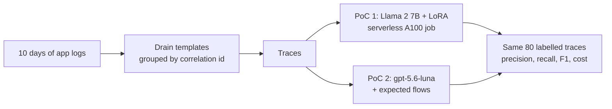
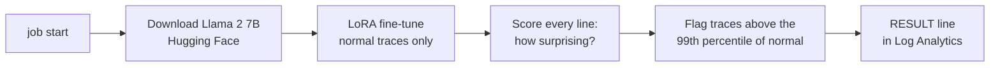
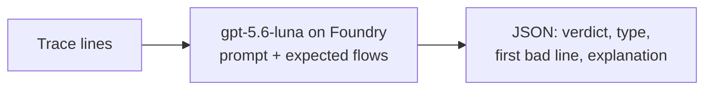
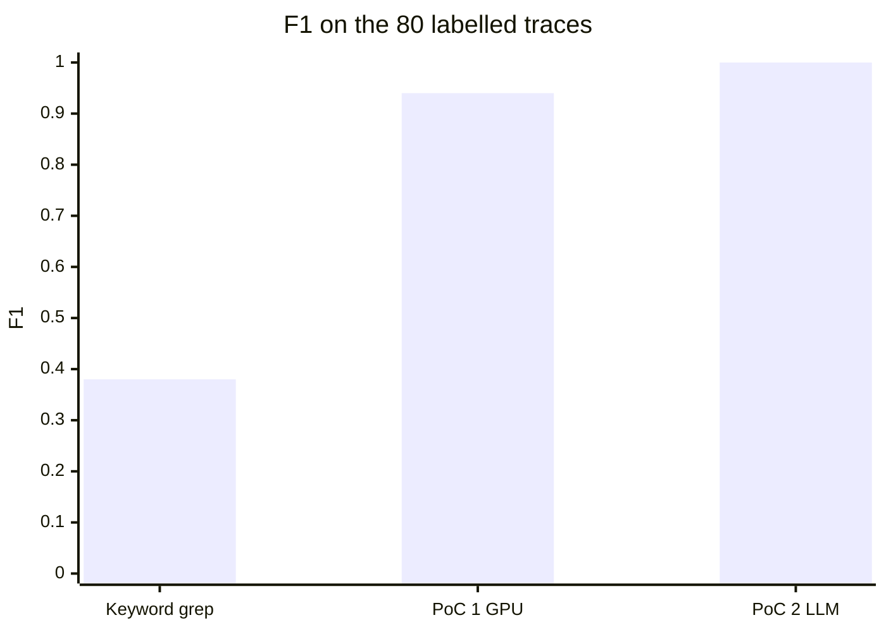

# Log anomaly detection: fine-tuned GPU model vs LLM

- Goal: catch broken business flows in production logs (visible errors and silent breaks) before customers notice
- Question: is fine-tuning a 7B model on a GPU worth it, or does one LLM call per trace do the job?
- Data: synthetic 10-day production-like extract (4 flows, 2 incidents, 80 labelled traces); no customer data in this repo

## How it works



### PoC 1: fine-tune on a serverless GPU (LogLLaMA approach)



- Learns only what normal looks like; never sees a labelled anomaly
- One Container Apps job on a serverless A100 80 GB; scales to zero, billed per second
- Every run records git commit, image tag, data hash and base model commit

### PoC 2: one LLM call per trace



- No training, no GPU: the flow description is the only domain input
- Structured Outputs: strict JSON schema with a precise description per field, see `SCHEMA` in `src/logpoc/poc2_llm/classify.py`
- EU Data Zone deployment, Entra ID only

## Results (synthetic rehearsal)



| | Keyword grep | PoC 1 Llama 2 7B, A100 | PoC 2 gpt-5.6-luna |
|---|---|---|---|
| Precision | 1.00 | 0.88 | 1.00 |
| Recall | 0.23 | 1.00 | 1.00 |
| F1 | 0.38 | 0.94 | 1.00 |
| False alarms (of 50 normal) | 0 | 4 | 0 |
| Silent breaks caught (of 23) | 0 | 23 | 23 |
| Time | < 1 s | 13 min job: 8 min training, 2 s scoring | 28 s for 80 traces |
| Cost, Azure list price | 0 | $0.34 training once, then $0.02 per 1,000 traces | $0.52 per 1,000 traces |

- Both PoCs caught all 30 anomalous traces, including the 23 silent breaks
- PoC 1: 4 false alarms; 4 harmless test traces contain a retry line that never occurred in training
- PoC 2: right anomaly type and first bad line for all 30 after describing every schema field (before: 1 false alarm, 1 wrong type, F1 0.98)
- PoC 2 was tuned on these 80 traces: confirm on the customer's own labelled set
- Per trace PoC 1 is about 30 times cheaper once trained, but it needs a GPU job and retraining whenever the logs change
- Keyword search only sees visible errors: 23 of the 30 anomalous traces never log an ERROR
- Run records: PoC 1 git `b43f546`, image `b43f546`, Llama 2 commit `8efe6c9`; PoC 2 git `6326680`; data hash `7f7c7aa4` for both

**LLM variants** (same 80 traces, all 80 calls in parallel, 333K tokens per minute per deployment, git `bdcf254`)

| Model, reasoning | F1 | Wrong verdicts | Output tokens | Time | Cost per 1,000 traces |
|---|---|---|---|---|---|
| gpt-5.6-luna, default | 1.00 | 0 | 6,086 | 28 s (4 threads) | $0.52 |
| gpt-5.6-luna, none | 0.98 | 1 missed silent skip | 3,361 | 7 s | $0.47 |
| gpt-6-luna, default | 1.00 | 0 | 7,291 | 8 s | $0.28 |
| gpt-6-luna, none | 0.98 | 1 false alarm | 3,441 | 7 s | $0.25 |

- gpt-6-luna is about half the price per token; input is about 80% of the cost, so reasoning `none` saves little and costs accuracy

## Azure ML vs the two PoCs

**Azure ML (GPU compute instance today)**
- \+ Full MLOps: experiment tracking, model registry, pipelines, managed endpoints
- \+ Compute clusters can scale to zero
- − Compute instances are VMs: they bill while on and their disks fill up (images, caches)
- − GPUs need VM-family quota: A100 and H100 quota is 0 in this subscription
- − The workspace brings storage, key vault and registry that tenant policies must allow
- − Most effort goes into the platform, not the model

**PoC 1: Container Apps serverless GPU job**
- \+ One image is the whole pipeline: download, train, evaluate
- \+ A100 80 GB billed per second, nothing to pay when idle, nothing to patch
- \+ Own GPU quota: ran here although A100 VM quota is 0
- \+ Versioned runs without extra services
- − No experiment UI or model registry (add MLflow if needed)
- − One GPU per replica, no multi-node training
- − Model downloads on every run (an Azure Files mount needs storage keys, blocked by policy here)
- − Still a model to retrain, threshold and own

**PoC 2: Foundry LLM**
- \+ No training, no GPU, no model to own
- \+ Explains each verdict: anomaly type, first bad line, one sentence
- \+ Change behaviour by editing the flow description, not by retraining
- − Pay per token: cost grows with traffic
- − Only as good as the flow description
- − Needs tokens-per-minute capacity sized for the traffic
- − Trace content goes to the model endpoint (EU Data Zone; values are masked)

## Azure setup: one resource group

- `infra/main.bicep`: Container Apps environment with a serverless A100 profile, registry, managed identity, Log Analytics, Foundry account and project with the `gpt-5.6-luna` deployment
- `infra/jobs.bicep`: the GPU job (`job-run`)
- Entra ID everywhere: no keys, no secrets
- Lessons from this subscription:
  - Sweden Central refused new Container Apps environments (capacity): Italy North worked
  - Policy switches off storage keys and public access: no Azure Files, the model goes to the replica disk (500 GB on A100)
  - Size the LLM deployment: the rate limit counts the prompt plus `max_completion_tokens` per call (300K tokens per minute here)

## Redo in the customer's tenant

- Prerequisites: Container Apps serverless A100 and `gpt-5.6-luna` Data Zone Standard quota in one region; Azure CLI; Python 3.12 with `uv`
- Customer data goes in `data/customer` (git-ignored), same shape as `data/synthetic/prod_like`:
  - `logs/*.log`, one event per line: `<ts> <LEVEL> <service> host=<host> corrId=<id> <message>`
  - `traces_labelled.jsonl`, `incidents.csv`, `flows.yaml`
- Add the customer's value fields to `MASKED_KEYS` in `src/logpoc/data/prepare.py`
- Official Llama 2 weights: accept Meta's licence on Hugging Face, set `meta-llama/Llama-2-7b-hf` in `configs/llama2_7b.yaml`, then `az containerapp job secret set -n job-run -g $RG --secrets hf-token=<token>` and `az containerapp job update -n job-run -g $RG --set-env-vars HF_TOKEN=secretref:hf-token`
- Behind a package proxy: add `--build-arg PIP_INDEX_URL=<feed>` to `az acr build`

```bash
uv venv --python 3.12 .venv && uv pip install -e ".[llm]"
export ML_ROOT=.ml
python -c "from pathlib import Path; from logpoc.data.generate_prod_like import write_splits; print(write_splits(Path('data/customer')))"

RG=rg-logpoc; az group create -n $RG -l italynorth
az deployment group create -g $RG -f infra/main.bicep -p userObjectId=$(az ad signed-in-user show --query id -o tsv)
ACR=$(az acr list -g $RG --query "[0].name" -o tsv); TAG=$(git rev-parse --short HEAD)
az acr build -r $ACR -t logpoc:$TAG --build-arg GIT_SHA=$TAG --build-arg IMAGE_TAG=$TAG .
az deployment group create -g $RG -f infra/jobs.bicep -p imageTag=$TAG data=data/customer

# PoC 1: one A100 run; when it has finished, copy its RESULT log line into a local run folder
az containerapp job update -n job-run -g $RG --set-env-vars RUN_ID=llama2-$TAG
az containerapp job start -n job-run -g $RG
WS=$(az monitor log-analytics workspace show -g $RG -n log-logpoc --query customerId -o tsv)
az monitor log-analytics query -w $WS --analytics-query "ContainerAppConsoleLogs_CL | where Log_s startswith 'RESULT ' | top 1 by TimeGenerated | project Log_s" --query "[0].Log_s" -o tsv | python -m logpoc save-result

# PoC 2 and the comparison table (.ml/runs/RUNS.md)
export AZURE_OPENAI_ENDPOINT=$(az deployment group show -g $RG -n main --query properties.outputs.foundryEndpoint.value -o tsv)
python -m logpoc poc2-llm --data data/customer --split test --context expected-flow --run-id llm-$TAG
python -m logpoc baseline-grep --data data/customer --split test --run-id grep-$TAG
python -m logpoc compare --pricing configs/pricing_azure_list.yaml
```

- More detail: [DECISIONS.md](DECISIONS.md), [data/synthetic/prod_like/README.md](data/synthetic/prod_like/README.md)
